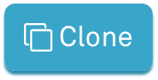
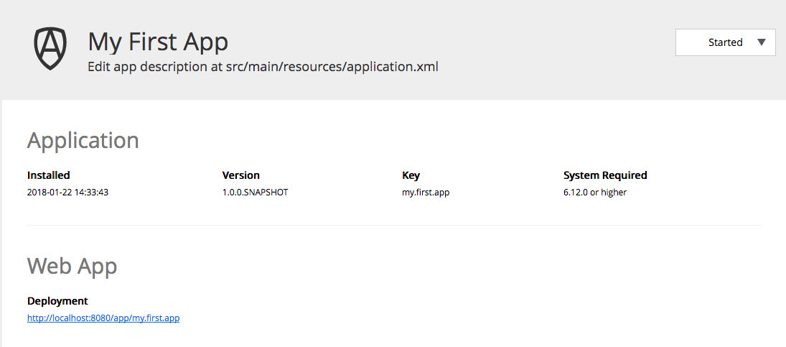
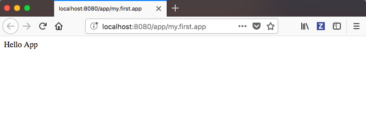

:source-highlighter: pygments

= My first app

A step-by-step guide to building your first application on the Enonic platform

== Installing the software development environment

In order to complete this guide, you need to have the Enonic development environment installed on your computer.
TODO

== Setting up your project

Lets create a project structure for your application. To be efficient, we will use an script to initialize our project from a template:

. *Open Vanilla Starter Kit* on https://market.enonic.com/vendors/enonic/vanilla-starter[Enonic Market]
. *Click the  button.*
. *Follow the instructions* run the init-project command

Once the script is completed, you will have generated a project folder, with a structure looking something like this:

TODO

[NOTE]
====
The following folders and files generated in the project will not be used in this tutorial, and you may optionally remove them:

  src/main/resources/site*
  src/main/resources/admin*

====

== Building and Deploying

Now that we have a project, its time to build and deploy the app to the development environment.

. *Change directory* to your newly created project folder
. *Run the build script*. The app file will be palaced in the build/libs/ folder

  ./gradlew build

. Deploy the app. This command will be placed

  ./gradlew deploy

. Verify that the app is installed from the Applications tool.

== Adding a root controller

Our small code contribution to this app will be a simple "Hello App" controller.
By placing a Javascript file called main.js in the resources/ folder of our project,
we are creating a root controller for our web application:

. *Create a new file* called `src/main/resources/main.js` in your project.
. *Add some code* to the main.js file and save:
+
[source,javascript]
----
include::../src/main/resources/main.js[]
----
+
. *Build and deploy* your application once more. NB! The deploy command will both build and deploy the app

  ./gradlew deploy

. Test the webapp - from the applications UI, you should now find a link to test the app.

When looking at the application from admin console again, you should see a new section called "Web app" in the details panel. This will contain a link ala localhost://app/my.first.app. Click the link to launch your app.

You should now see something like this:

TODO

== Suggested next steps

The Enonic Team salutes you on building your first app, below are links to learn more about Enonic XP:

Route handling
My First site
Controllers
Templating
