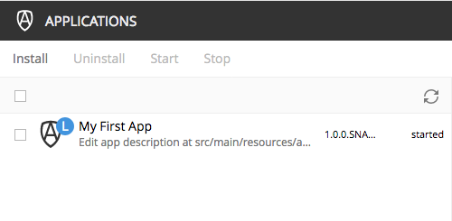

= My first app

*A step-by-step tutorial for building your first web application on the Enonic platform*

****
[CAUTION]
====
In order to complete this tutorial, the Enonic development environment must be installed on your computer:
https://developer.enonic.com/enonic-101/install-developer-environment
====
****

== Setting up your project

With the development set up, you are ready to create a project structure for the application. To be efficient, we will use an script to initialize our project from a template:

. *Go to the Vanilla Starter Kit* on https://market.enonic.com/vendors/enonic/vanilla-starter[Enonic Market]
. *Click the image:images/clone.png[Clone, 80] button.*
. *Follow the instructions* run the init-project command. Use the name `my.first.app`
. *Verify project files*. The command will now have generated a project file structure:
[source,files]
----
build.gradle <1>
gradle.properties <2>
src/
 main/
  resources/ <3>
   assets/ <4>
   application.svg <5>
   application.xml <6>
----

<1> Contains metadata on the maker of the app and more
<2> Specifies the name and version of the app and more
<3> The main directory where code is placed
<4> This is where we place css, images and javascript files to be served directly
<5> Replace this icon to get a different icon for your app
<6> Optionally change the description of your app here

NOTE: The other files and folders in the project structure are not relevant for this tutorial.

== Building and Deploying

Now that we have a project, its time to build and deploy the app to the development environment.

. *Change directory* to your newly created project folder
. *Run the build script*. The app file will be placed in the build/libs/ folder.

  ./gradlew build

. Deploy the app. This command will be placed

  ./gradlew deploy

. Verify that the app is installed and started from the Applications tool.

== Adding a root controller

Its time to contribute some code in the form of a simple "Hello App" controller.
By placing a Javascript file called main.js in the resources/ folder of our project,
we instantly have a root controller for our web application:

. *Create a new file* called `src/main/resources/main.js` in your project.
. *Add some code* to the main.js file and save:
+
[source,javascript]
----
include::../src/main/resources/main.js[]
----
+
. *Build and deploy* your application once more. NB! The deploy command will both build and deploy the app

  ./gradlew deploy

. *Test the webapp*. It should be available on http://localhost:8080/app/my.first.app You can also find the link from the admin Applications UI. If everything went well, it will look somethink like the screenshot below:

image::images/hello.png["Output from main.js controller"]

[quote, The Enonic Team]
Congratulations on building your first Enonic App!
